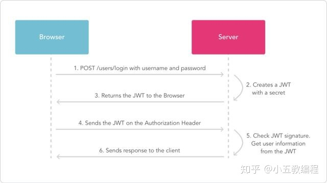

# SpringBoot jwt 接入Demo

> JSON Web Token（JWT）是目前最流行的跨域身份验证解决方案之一

## 引入依赖

```xml
<dependency>
    <groupId>com.auth0</groupId>
    <artifactId>java-jwt</artifactId>
    <version>3.19.2</version>
</dependency>
```
> 其他工具依赖按需引入即可

## jwt数据流程




## 参考资料
> [JWT认证：实例演示](https://juejin.cn/post/6969074624650805262)
